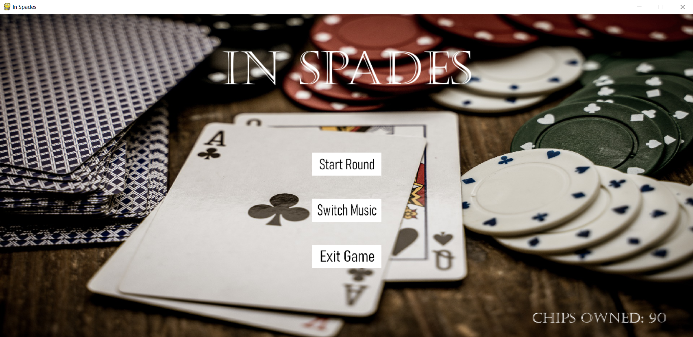
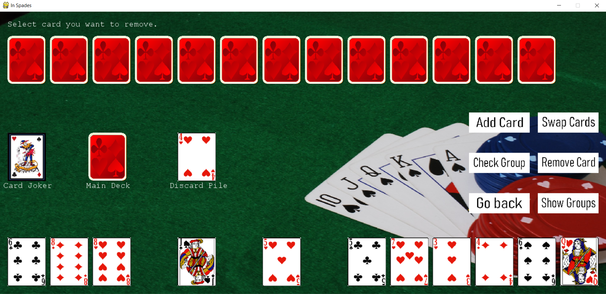

# InSpades

<h1> 
   
</h1>

## About :rocket:
In Spades is a strategical, single player card game played against a computer. Both the player and computer try to build sets and lifes/runs while smartly choosing and removing cards. The rules and how to play the game can be found in rules.txt

This project has been built from scratch by me using Pygame.

## Features :tada:
- Built with an interactive GUI
- Has inbuilt mini music system (check out: /music/credits.txt for music credits)
- The computer doesn't move randomly but tries to maximize it's chances of winning
- Each game run, is completely logged and can be found in GameLog.log, making it easier to debug
- The project follows OOP practices and concepts and has special classes for player, computer, dealer, rounds

## Setup :ringed_planet:
- Download the repository
- Run the command: `pip3 install -r requirements.txt`
- To start the game, run: `python3 main.py`

## Gameplay Screenshots :camera:

    

*Contact Me:*

:headphones: [Manas Gupta](https://github.com/Manas2030)  
